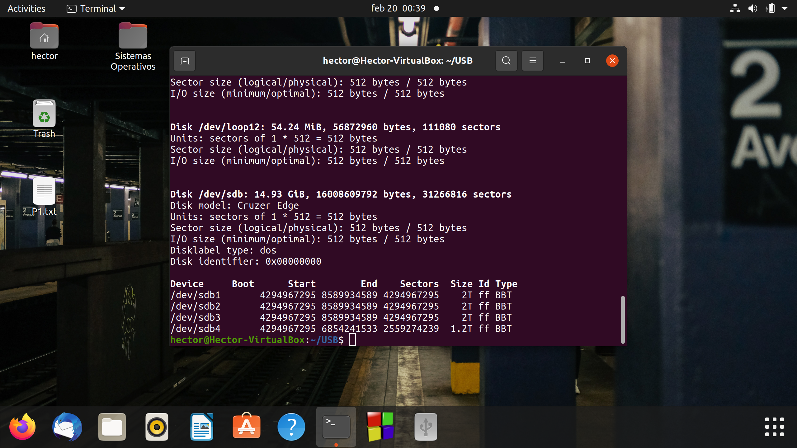

# SistemasOperativosII-P1
Repositorio de la práctica 1 de Sistemas Operativos II, acerca de como particionar una USB.

## Paso 1 Diferences entre hda, sda y vda. ¿Qué significa la letra y el número al final de los identificadores?
Las letras sd, hd y vd indican el tipo de puerto que está utilizando la unidad de almacenamiento:
SD: Se refiere a los dispositivos que están utilizando el puerto USB, o discos duros que utilizan el puerto SATA. También se puede referir a dispositivos que utilizan la conexión SCSI, un estándar de transferencia de datos utilizado en RAIDs pero que ha sido reemplazado en gran medida por el puerto SATA.
HD: Se refiere a dispositivos que utilizan el estándar ATA, originalmente conocido como IDE. De igual manera, ha sido reemplazado por el puerto Serial ATA.
Vda: Se refiere a unidades que están usando la paravirtualización, la cual es una técnica que permite a la emulación del sistema operativo, no simular al 100% el dispositivo de almacenamiento como si se tratara de una unidad de hardware real, lo cual permite una comunicación más directa y por lo tanto más rápida.
Respecto a las letras después de las letras, éstas se refieren al orden que llevan estas unidades, es decir sda, será el primer dispositivo tipo sd, sdb el segundo dispositivo conectado tipo sd, etc.
Y, por último, el número al final se refiere al número de partición de esa unidad.

## Paso 2 ¿Cómo montar y desmontar una usb en el sistema por terminal?
Para montar y desmontar una usb, se utilizan los comandos mount y umount respectivamente. 
Al conectar nuestra usb ubuntu la monta automáticamente. En la imagen se puede observar la salida del comando lsblk, donde se ve que se encuentra montado el archivo sdb. 

Para desmontarla, ocupamos el siguiente comando:
umount /dev/sdb
donde /dev/sdb es la dirección del archivo bloque que contiene montado al usb.

Comando umount /dev/sdb utilizado.

Salida de lsblk después de desmontar la usb. 
Para montar la usb, necesitamos crear una carpeta la cual contendrá los archivos necesarios. Crearemos una carpeta en el home, llamada USB, la cual contendrá otra carpeta llamada USBPart. Ahí serán guardados los archivos de bloque. 

Creación de la carpeta. 

Uso del comando mount, el cual es necesario ejecutar con sudo pues se necesitan permisos de super usuario ya que estos comandos modifican directamente el hardware. 
Al utilizar el comando mount de esta manera, la carpeta no será creada con todos los permisos disponibles para el usuario. Para poder obtener todos los permisos, hay que desmontar la USB, se debe utilizar el umask, y volver a ejecutar el comando mount con parámetros adicionales. 

Uso del comando mount con parámetros adicionales, como se puede observar la carpeta ya cuenta con todos los permisos. 

## Paso 3 Enlistar la información de los dispositivos de bloque conectados aunque no estén montados en terminal.
Para el paso 3 se vuelve a desplegar los archivos de bloque, y se mostrarán los archivos incluso los de aquellas unidades que no estén montadas. 

 
Se puede observar el bloque /dev/sdb aunque no esté montado. 

## Paso 4 Mostrar la tabla de particiones del disco donde está instalado el sistema operativo en terminal.
Para este paso,  utilizamos el comando fdisk -l /dev/sda. El comando nos permitirá visualizar las particiones de la unidad sda, la cual es el disco duro virtual donde está contenido el sistema operativo. 

## Paso 5 Conectar una memoria usb y mostrar su tabla de particiones en terminal. (Hacer respaldo antes porque se borrará toda la información dentro de la usb en pasos posteriores)
Para el paso 5 volveremos a utilizar el comando fdisk -l, pero ahora le pasaremos el archivo de bloques de la USB, para poder observar sus particiones. 

## Paso 6 (Borrar todas las particiones de la usb en terminal.
Para realizar el paso 6, utilizaremos ahora el comando fdisk sin el -l, pues así esta herramienta nos permitirá modificar las particiones de la USB. 
Una vez en la herramienta, deberemos presionar la tecla d, y después el número de partición que queremos eliminar. En este caso repetiremos el proceso 4 veces, pues queremos eliminar las 4 particiones.

 Por último, se debe presionar la tecla w para guardar cambios. 

Se muestra la salida del comando fdisk -l después de borrar las particiones, y como se puede observar, ya no están. 

## Paso 7 Crear en el usb tres particiones físicas y una extendida en terminal.
Para este paso, de igual manera utilizaremos el comando fdisk. Ahora en lugar de utilizar la letra d, utilizaremos la letra n, la cual preguntará que tipo de partición queremos crear. Para crear una primaria (física) se debe escribir la letra p, para crear una extendida se debe escribir una letra e. Después nos preguntará el número de partición, los cuales irán del 1 al 4. Después preguntará el sector donde comenzará la partición, y por último preguntará de qué tamaño será la partición. A las primeras 3 particiones se les asignará el tamaño de 1 GiB.
Ejemplo partición 1 física:

Ejemplo partición 2:

Ejemplo partición 3:

Ejemplo partición 4 (extendida):

Esta será la más grande, y podrá contener varias particiones lógicas dentro de ella. 

Impresión de fdisk -l de /dev/sdb ya con las 4 particiones creadas. 
## Paso 8 Crear una partición dentro de la partición extendida de la usb en terminal.
Parar el paso 8, volveremos a utilizar fdisk. El comando automáticamente nos dejará poner una partición lógica a lo largo de la partición extendida que hemos creado. 

Se puede observar como el comando automáticamente detecta la partición lógica. 

## Paso 9 En la interfaz gráfica de la aplicación disks, borrar las particiones para que solo exista una partición que abarque toda la usb. 
Para el punto 9 se utilizará la herramienta disks de Ubuntu, la cual nos permite modificar las particiones utilizando una aplicación de interfaz gráfica. 

Se presionará el botón menos debajo de la partición para eliminarla.

Pedirá confirmación y le damos en delete.
Repetimos el proceso con cada partición hasta que no quede ninguna.

Y se vuelve a crear una partición física que abarque todo el tamaño de la USB.

## Paso 10 Copiar un archivo .iso de distribución live de linux a la usb por medio del comando "dd".
Para este paso descargaremos un .iso de Ubuntu desde su página oficial. 

Para copiarlo a nuestra usb, utilizaremos el comando dd de la siguiente manera: 
Sudo dd if = /isos/Ubuntu-

Se empezará a copiar el .iso a la USB, por lo que en este paso solo queda esperar.

